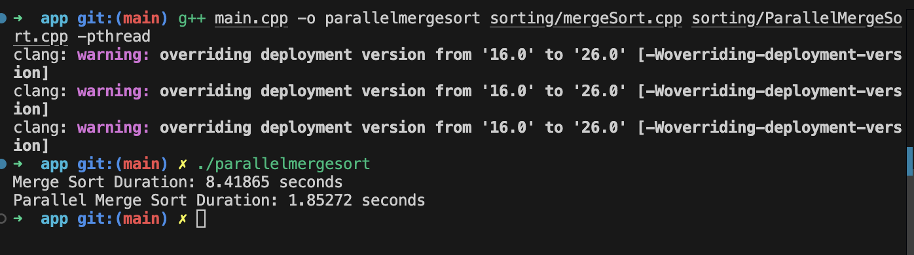

# Multithreaded Merge Sort

A C++ implementation of both serial and parallel (multithreaded) merge sort algorithms.

## Features

- **MergeSort**: Standard recursive merge sort.
- **ParallelMergeSort**: Uses `std::thread` to sort sub-arrays in parallel for large data sets.

## Requirements

- A C++17 (or newer) compiler (e.g., `g++`, `clang++`).
- Make sure to compile with `-pthread` when using `ParallelMergeSort`.

## Build & Run

```bash
cd src/app
g++ -o parallelmergesort sorting/mergeSort.cpp sorting/ParallelMergeSort.cpp -pthread
```

## Usage

The `main` program benchmarks serial vs. parallel merge sort on a vector of random integers. Modify `SIZE` in `main.cpp` for different input sizes.

## Project Structure

```
multithreaded_mergesort/
├── src/
│   └── app/
│       ├── main.cpp
│       └── sorting/
│           ├── mergeSort.cpp
│           ├── mergeSort.hpp
│           ├── ParallelMergeSort.cpp
│           └── ParallelMergeSort.hpp
└── README.md
```



## License

MIT © 2025
